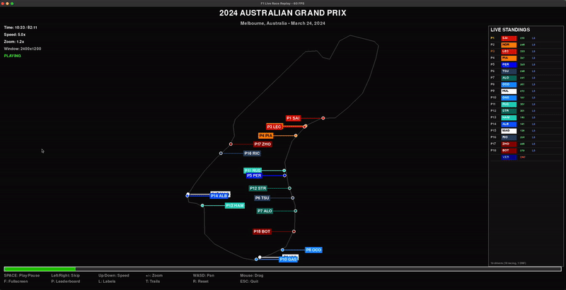

# Formula 1 Telemetry Visualization Dashboard

A comprehensive Streamlit web application for analyzing and visualizing Formula 1 race telemetry data. Watch races replay in real-time, compare driver performance, and dive deep into telemetry metrics like speed, throttle, tire strategy, and racing lines.

## Demo

**Live Race Replay:**

[Watch Full Demo on YouTube](https://www.youtube.com/watch?v=cO7lA_vxitY)

## Tech Stack

### Core Technologies
- **Python** 
- **Streamlit** 
- **Pandas** 
- **Plotly** 
- **NumPy** 

### Data Source
- **FastF1 API** - Official F1 timing data and telemetry
  - Lap times and sector times
  - Car telemetry (speed, throttle, RPM, gear, DRS)
  - GPS position data
  - Tire information and pit stop data

## Features

### Race Overview
- Final race results and standings
- Position changes throughout the race
- Lap time evolution and comparisons

### Live Race Replay
- Animated track map showing all drivers racing simultaneously
- Real-time position updates synced to actual race time
- Adjustable playback speed (1-20x)
- Optional car trails showing recent movement
- Live telemetry metrics and standings tower

### Synchronized Telemetry Analysis
- Compare speed, RPM, throttle, and gear selection across all drivers
- Time-synchronized charts showing the exact same moment in the race
- Adjustable time windows (30-300 seconds)
- Auto-play mode to watch telemetry evolve through the race
- Real-time metrics table

### Tire Strategy
- Visual tire stint timeline for each driver
- Tire degradation analysis (lap time vs tire life)
- Compound usage comparison

### Track Analysis
- Interactive track maps colored by speed or throttle
- Speed traces showing velocity at each point on track
- Gear selection visualization around the circuit
- Lap-by-lap playback with auto-advance

### Detailed Metrics
- Raw lap data and telemetry tables
- Statistical summaries (max speed, average RPM, throttle usage, DRS stats)
- Per-driver deep dive

## Screenshots

